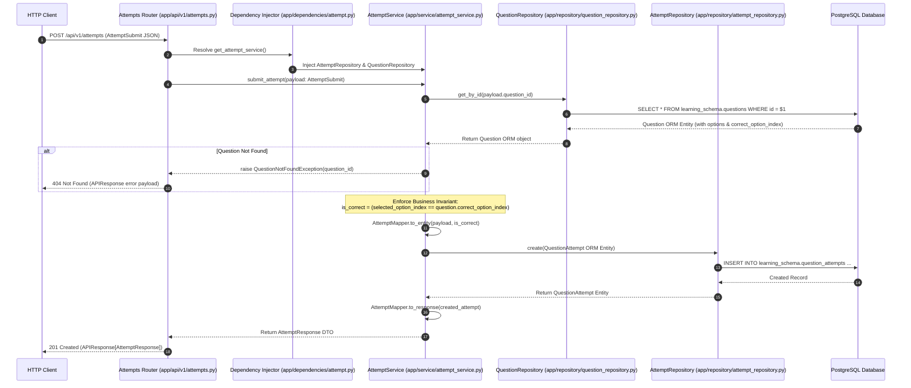
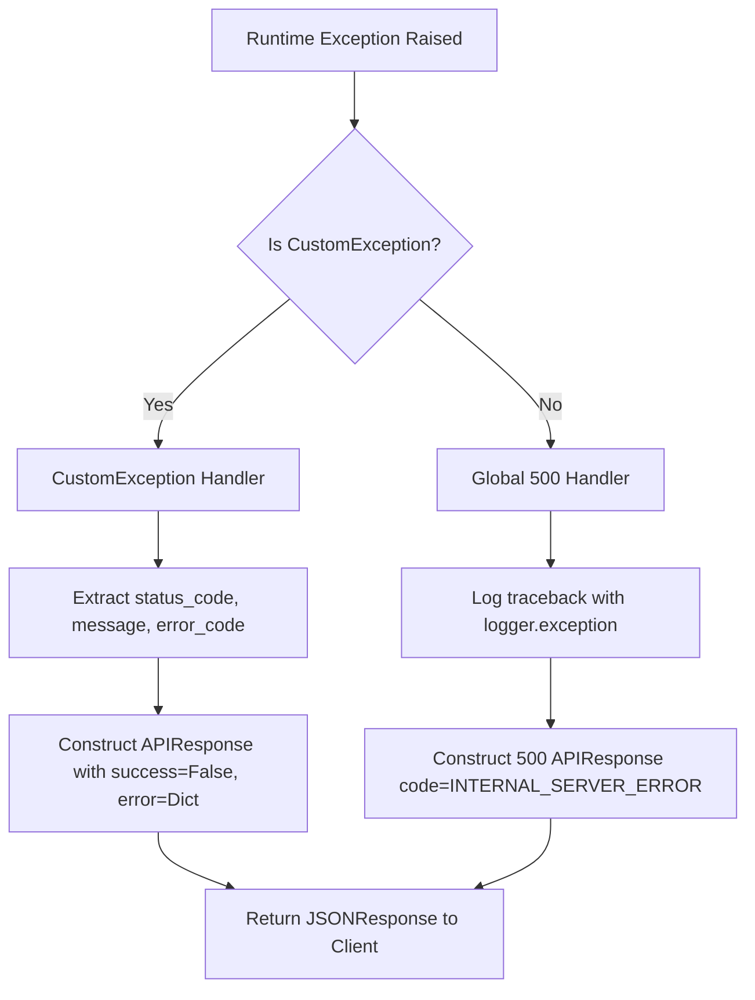

# Architecture & System Design Documentation

## Executive Overview

The **Maxemo Learning Analytics Service** is constructed using **Clean Architecture** principles adapted for modern Python 3.12 microservices. The core philosophy is **strict separation of concerns**, **unidirectional dependency flow** (inner domain layers know nothing about outer HTTP/database layers), and **inversion of control (IoC)** via FastAPI dependency injection.

---

## 1. Clean Architecture Layers

```mermaid
graph TD
    subgraph Presentation Layer ["Presentation Layer (app/api/)"]
        A[FastAPI Routers] --> B[Pydantic Request/Response DTOs]
    end

    subgraph Service & Interface Layer ["Service & Interface Layer (app/service/, app/interface/)"]
        C[Abstract Service Interfaces - ABC] --> D[Domain Service Implementations]
        D --> E[Custom Domain Exceptions]
        D --> F[DTO Mappers]
    end

    subgraph Repository Layer ["Repository Layer (app/repository/, app/utils/)"]
        G[BaseRepository - Generic] --> H[QueryBuilder - Window Count]
        H --> I[Concrete Repositories - Topic, Question, Attempt]
    end

    subgraph Database Infrastructure Layer ["Database Infrastructure Layer (app/core/, app/model/)"]
        J[Async SQLAlchemy Engine] --> K[PostgreSQL 16 - learning_schema]
    end

    Presentation Layer --> Service & Interface Layer
    Service & Interface Layer --> Repository Layer
    Repository Layer --> Database Infrastructure Layer
```

### Layer Breakdown

#### A. Presentation Layer (`app/api/v1/`, `app/api/health.py`)
- **Responsibility**: HTTP request parsing, query parameter validation, routing, HTTP status code response formatting, and OpenAPI schema generation.
- **Rules**:
  - Routers contain **zero business logic**.
  - Handlers accept Pydantic DTOs and injected Service Interfaces via `Depends()`.
  - All responses are wrapped in standard `APIResponse[T]` or `APIResponse[PaginatedResponse[T]]`.

#### B. Service & Domain Layer (`app/service/`, `app/interface/`, `app/mapper/`, `app/exception/`)
- **Responsibility**: Business rules, invariants, validation logic, entity transformations, scoring calculations, and orchestrating repositories.
- **Rules**:
  - Services inherit from abstract base classes (`ITopicService`, `IQuestionService`, `IAttemptService`).
  - Services accept and return Pydantic DTO objects directly.
  - Exception triggers raise domain-specific exceptions (`QuestionNotFoundException`, `InvalidOptionIndexException`).

#### C. Data Access & Repository Layer (`app/repository/`, `app/utils/repository/`)
- **Responsibility**: Constructing type-safe SQLAlchemy queries, executing database calls, handling pagination/filtering/sorting, and fetching raw DB aggregate tuples.
- **Rules**:
  - Repositories perform **pure data access only**. They do not calculate percentages or mutate business states.
  - Implement single-query `COUNT(*) OVER()` window count pagination via `BaseRepository.list_generic`.

#### D. Infrastructure Layer (`app/core/`, `app/model/`)
- **Responsibility**: DB connection pool management (`asyncpg`), environment configuration (`pydantic-settings`), logging configuration, and ORM entity declarations (`app/model/`).

---

## 2. Request & Execution Lifecycle

The sequence diagram below traces an incoming HTTP submission (`POST /api/v1/attempts`) through all layers of the system:



---

## 3. Dependency Flow & Modular Inversion of Control

To avoid **circular imports** in Python microservices, dependencies are organized into domain-isolated modules under `app/dependencies/`:

```
app/dependencies/
├── __init__.py       # Re-exports all dependency factories
├── database.py       # AsyncSession generator (get_db_session)
├── topic.py          # get_topic_repository, get_topic_service
├── question.py       # get_question_repository, get_question_service
└── attempt.py        # get_attempt_repository, get_attempt_service
```

### Injection Flow
1. FastAPI resolves `get_attempt_service(db: AsyncSession = Depends(get_db_session))`.
2. `get_attempt_service` instantiates concrete `AttemptRepository(db)` and `QuestionRepository(db)`.
3. `AttemptService` is instantiated with these repository instances and returned as `IAttemptService`.

---

## 4. Error & Exception Handling Architecture

All exceptions derive from `CustomException` (`app/exception/base.py`) which defines standard attributes: `message`, `error_code`, and `status_code`.



### Exception Class Taxonomy
- **`QuestionNotFoundException`** (HTTP 404, `QUESTION_NOT_FOUND`)
- **`TopicNotFoundException`** (HTTP 404, `TOPIC_NOT_FOUND`)
- **`TopicAlreadyExistsException`** (HTTP 409, `TOPIC_ALREADY_EXISTS`)
- **`InvalidOptionIndexException`** (HTTP 400, `INVALID_OPTION_INDEX`)

---

## 5. Configuration & Environment Management

Configuration management is powered by `pydantic-settings` in `app/core/config.py`:
- Reads environment variables from system env or `.env` file.
- Enforces strict validation of DB connection strings, log levels, and application metadata.
- Leverages `@lru_cache` on `get_settings()` to avoid reading `.env` on every request.

---

## 6. Architectural Trade-Offs & Scaling Analysis

| Decision | Pros | Cons | Mitigation / Evolution |
|---|---|---|---|
| **Stateless Performance Calculations** | No state sync bugs; accurate real-time aggregates | Higher DB CPU load on massive attempt tables | Composite indexes `(user_id, question_id)` + Read Replicas |
| **Monolithic Microservice Service Structure** | High cohesion, zero network latency between components | All endpoints share process memory | Separate into read/write microservices if RPS exceeds 50,000 |
| **Generic List Window Query** | 1 DB roundtrip for items + total count | Window count can be slow on 10M+ rows without indexes | Add index-covered filter columns or table partitioning |
