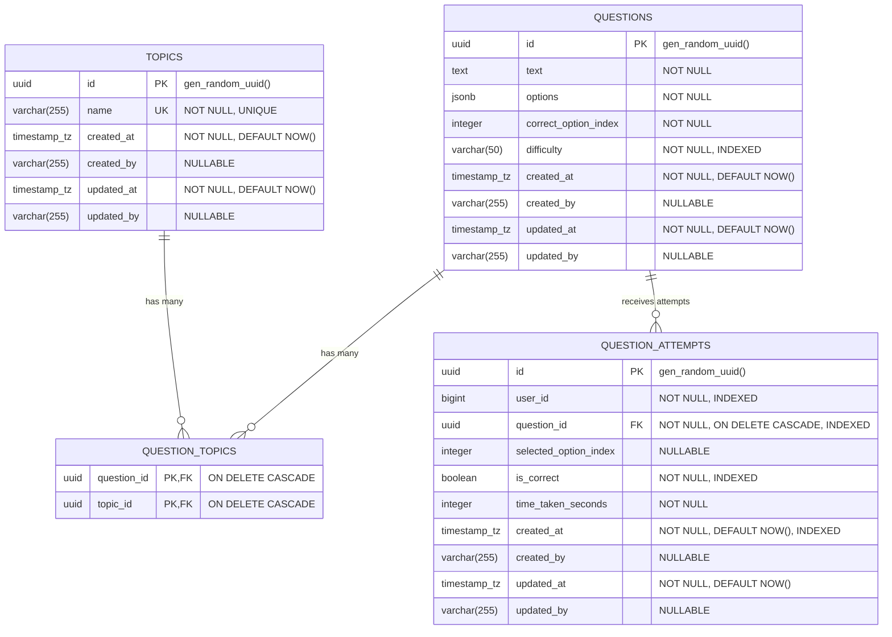

# Database Architecture & Schema Documentation

## Executive Summary

The database architecture is designed for **PostgreSQL 16** using the **`learning_schema`** PostgreSQL schema. The schema supports ACID compliance, relational integrity, server-enforced foreign key cascade rules, and optimized index structures for both analytical queries and fast key-value lookups.

---

## 1. Entity-Relationship (ER) Diagram



---

## 2. Table Specifications & Constraints

### A. Table: `learning_schema.topics`
Stores high-level subject categories (e.g. "Cardiology", "Neurology").

| Column Name | Data Type | Constraints | Description |
|---|---|---|---|
| `id` | `UUID` | Primary Key, `DEFAULT gen_random_uuid()` | Unique identifier for topic |
| `name` | `VARCHAR(255)` | `NOT NULL`, `UNIQUE` | Unique human-readable topic name |
| `created_at` | `TIMESTAMPTZ` | `NOT NULL`, `DEFAULT NOW()` | Audit timestamp of creation |
| `updated_at` | `TIMESTAMPTZ` | `NOT NULL`, `DEFAULT NOW()` | Audit timestamp of last update |

### B. Table: `learning_schema.questions`
Stores clinical multiple-choice questions, options JSON arrays, and difficulty classifications.

| Column Name | Data Type | Constraints | Description |
|---|---|---|---|
| `id` | `UUID` | Primary Key, `DEFAULT gen_random_uuid()` | Unique identifier for question |
| `text` | `TEXT` | `NOT NULL` | Stem text of the question |
| `options` | `JSONB` | `NOT NULL` | Array of option text strings (JSONB format) |
| `correct_option_index` | `INTEGER` | `NOT NULL` | 0-based index of correct option |
| `difficulty` | `VARCHAR(50)` | `NOT NULL`, Indexed | Difficulty level (`easy`, `medium`, `hard`) |
| `created_at` | `TIMESTAMPTZ` | `NOT NULL`, `DEFAULT NOW()` | Audit timestamp of creation |

### C. Table: `learning_schema.question_topics` (Junction Table)
Many-to-Many join table linking Questions to Topics.

| Column Name | Data Type | Constraints | Description |
|---|---|---|---|
| `question_id` | `UUID` | PK, FK -> `questions.id` `ON DELETE CASCADE` | Reference to parent Question |
| `topic_id` | `UUID` | PK, FK -> `topics.id` `ON DELETE CASCADE` | Reference to parent Topic |

### D. Table: `learning_schema.question_attempts`
Records every learner response attempt for analytical scoring and revision engine computations.

| Column Name | Data Type | Constraints | Description |
|---|---|---|---|
| `id` | `UUID` | Primary Key, `DEFAULT gen_random_uuid()` | Unique identifier for attempt |
| `user_id` | `BIGINT` | `NOT NULL`, Indexed | External learner user ID |
| `question_id` | `UUID` | FK -> `questions.id` `ON DELETE CASCADE`, Indexed | Reference to attempted Question |
| `selected_option_index` | `INTEGER` | Nullable | Selected option index (null if skipped) |
| `is_correct` | `BOOLEAN` | `NOT NULL`, Indexed | Server-computed correctness status |
| `time_taken_seconds` | `INTEGER` | `NOT NULL` | Time spent answering in seconds |
| `created_at` | `TIMESTAMPTZ` | `NOT NULL`, `DEFAULT NOW()`, Indexed | Timestamp when attempt was submitted |

---

## 3. Database Indexing Strategy

To support high-throughput read/write workloads, explicit database indexes have been applied:

```sql
-- 1. Unique B-Tree Index on Topic Name
CREATE UNIQUE INDEX ix_learning_schema_topics_name 
ON learning_schema.topics (name);

-- 2. Single Column B-Tree Indexes on Questions
CREATE INDEX ix_learning_schema_questions_difficulty 
ON learning_schema.questions (difficulty);

-- 3. Composite & Single-Column B-Tree Indexes on Question Attempts
CREATE INDEX ix_learning_schema_question_attempts_user_id 
ON learning_schema.question_attempts (user_id);

CREATE INDEX ix_learning_schema_question_attempts_question_id 
ON learning_schema.question_attempts (question_id);

CREATE INDEX ix_learning_schema_question_attempts_is_correct 
ON learning_schema.question_attempts (is_correct);

CREATE INDEX ix_learning_schema_question_attempts_created_at 
ON learning_schema.question_attempts (created_at DESC);

-- Composite Index for User Aggregations & Performance Summary Queries
CREATE INDEX ix_attempts_user_question_correct 
ON learning_schema.question_attempts (user_id, question_id, is_correct);
```

### Why Each Index Exists

1. **`ix_learning_schema_topics_name`**: Ensures duplicate topic creation attempts fail at the database level ($O(1)$ lookup speed).
2. **`ix_learning_schema_questions_difficulty`**: Speeds up filtered pagination queries when filtering questions by `easy`, `medium`, or `hard`.
3. **`ix_attempts_user_question_correct`**: Essential for performance analytics (`GET /api/v1/attempts/users/{id}/performance`) and revision recommendations. Allows PostgreSQL to perform index-only scans when computing user accuracy aggregates without scanning raw table heaps.

---

## 4. Primary Query Patterns & Execution Performance

### A. Single-Query Window Count Pagination Query
Executed by `BaseRepository.list_generic`:

```sql
SELECT 
    q.id, q.text, q.options, q.correct_option_index, q.difficulty, q.created_at,
    COUNT(*) OVER() AS total_count
FROM learning_schema.questions q
WHERE q.difficulty = 'medium' AND q.text ILIKE '%cell%'
ORDER BY q.created_at DESC
OFFSET 0 LIMIT 20;
```

### B. User Performance Raw Aggregation Query
Executed by `AttemptRepository.get_raw_user_performance`:

```sql
SELECT 
    COUNT(id) AS total_attempts,
    SUM(CASE WHEN is_correct IS TRUE THEN 1 ELSE 0 END) AS correct_attempts,
    SUM(time_taken_seconds) AS total_time_seconds
FROM learning_schema.question_attempts
WHERE user_id = 101;
```

---

## 5. Expected Bottlenecks & Database Scaling Strategy

### Identified Bottleneck
As `question_attempts` grows beyond **10,000,000+ rows**, calculating `COUNT()` and `SUM()` aggregates on-the-fly for active users will increase DB CPU consumption.

### Remediation & Scaling Milestones

1. **Phase 1 (Current - < 1,000,000 rows)**: Direct SQL aggregates utilizing composite B-Tree index `(user_id, question_id, is_correct)`. Response time < 5ms.
2. **Phase 2 (1M - 10M rows)**: PostgreSQL Read Replicas. Direct read queries to replicas to protect primary database write IOPS.
3. **Phase 3 (> 10M rows)**: Declarative Table Partitioning by Range (`created_at` or `user_id` hash partitioning) to keep active query working sets inside RAM buffers.
