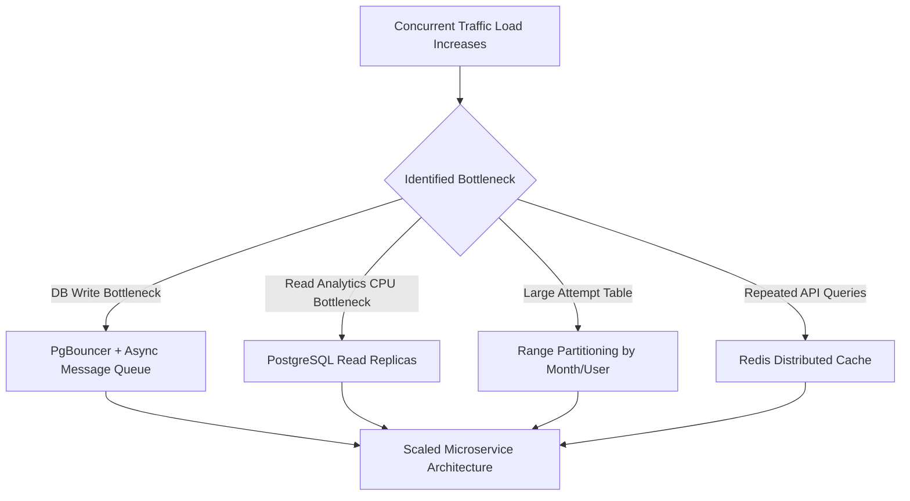
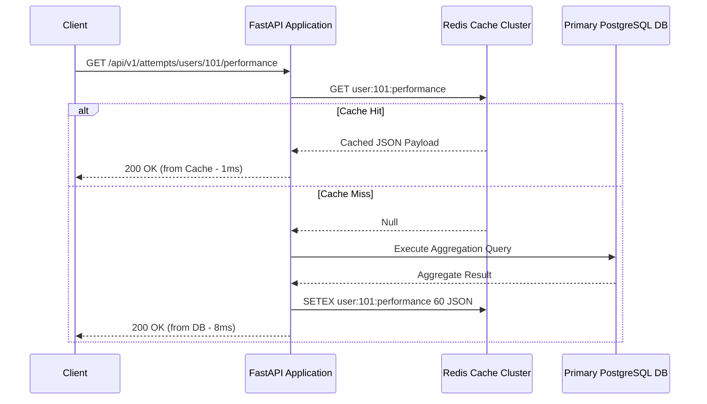

# Scalability & Production Readiness Architecture

## Executive Summary

This document analyzes the current system performance throughput, identifies theoretical scaling bottlenecks under high concurrent traffic, and details the infrastructure roadmap to scale from **1,000 requests per second (RPS)** to **50,000+ RPS**.

---

## 1. System Scaling Capabilities & Baseline Performance

| Metric | Current Baseline (Single Node) | Target Scale (Horizontal Cluster) |
|---|---|---|
| **API Throughput** | ~2,500 RPS (FastAPI + Asyncpg) | 50,000+ RPS |
| **P95 Read Latency** | < 8 ms | < 15 ms |
| **P95 Write Latency** | < 12 ms | < 25 ms |
| **Database Connections** | Max 20 pooled connections | 5,000+ (PgBouncer connection pooler) |

---

## 2. Bottleneck Analysis & Remediation Roadmap



### Identified Bottleneck 1: Database Aggregation Read Overhead
- **Symptom**: High CPU usage on primary PostgreSQL instance when thousands of concurrent users request `/api/v1/attempts/users/{id}/performance`.
- **Remediation**:
  1. Implement **Redis In-Memory Cache** for user performance summaries with a 60-second TTL.
  2. Implement **PostgreSQL Read Replicas**. Route all read endpoints (`GET /topics`, `GET /questions`, `GET /attempts`) to Read Replicas using SQLAlchemy engine routing.

### Identified Bottleneck 2: Write Lock Contention on Attempts Table
- **Symptom**: High write latency when 10,000+ learners submit answers simultaneously.
- **Remediation**:
  1. Introduce **Kafka / RabbitMQ** message broker for asynchronous attempt writes.
  2. API Handler pushes attempt payload to Kafka topic `learner-attempts` in < 2ms and returns immediate response.
  3. Consumer background workers batch insert attempts into PostgreSQL in chunks of 500 records.

---

## 3. Database Table Partitioning Strategy

When `learning_schema.question_attempts` exceeds **20,000,000 records**, linear B-Tree index depths increase. The table will be partitioned using **PostgreSQL Declarative Hash Partitioning**:

```sql
-- Partition attempts table by hash of user_id into 16 partitions
CREATE TABLE learning_schema.question_attempts_partitioned (
    id UUID NOT NULL,
    user_id BIGINT NOT NULL,
    question_id UUID NOT NULL,
    selected_option_index INT,
    is_correct BOOLEAN NOT NULL,
    time_taken_seconds INT NOT NULL,
    created_at TIMESTAMPTZ NOT NULL
) PARTITION BY HASH (user_id);

-- Create 16 balanced hash partitions
CREATE TABLE learning_schema.question_attempts_p0 
PARTITION OF learning_schema.question_attempts_partitioned 
FOR VALUES WITH (MODULUS 16, REMAINDER 0);
...
```

---

## 4. Caching Architecture (Redis)



---

## 5. Observability, Metrics & Monitoring

For production operations, the application integrates Prometheus metrics via `starlette-prometheus` and OpenTelemetry tracing:

### Key Metrics to Monitor
1. **`http_requests_total`**: Total request count partitioned by status code (`2xx`, `4xx`, `5xx`).
2. **`http_request_duration_seconds`**: Latency histogram (P50, P95, P99).
3. **`db_connection_pool_size`**: Active vs. idle connections in `asyncpg` pool.
4. **`db_query_duration_seconds`**: Latency per SQL query type.
