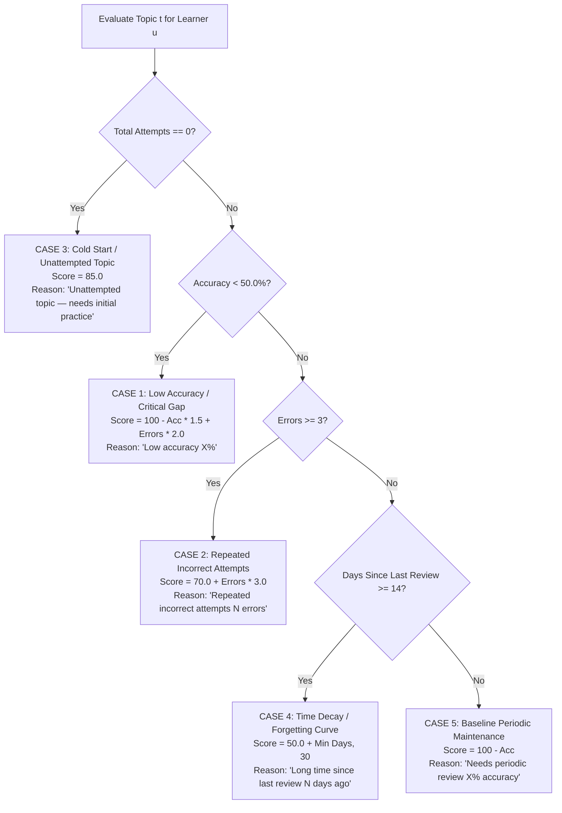

# 📐 Production Topic Revision Recommendation Engine

## Executive Overview

In medical clinical education (e.g., USMLE, MedEd, board exams), effective revision requires prioritizing **topic-level knowledge gaps**, **repeated errors**, and **memory decay**.

The **Personalized Revision Recommendation Engine** (`GET /api/v1/users/{user_id}/revision`) calculates a dynamic, explainable revision queue of the **top ~5 topics** a learner should revise next. 

Each recommendation includes a 1-indexed `priority` rank, accuracy metrics, and a human-readable `reason` string explaining why the topic was selected.

---

## 1. 🔢 Mathematical Scoring Formula

For each topic $t \in T$ in the system, the algorithm calculates a dynamic **Priority Score** $\mathcal{S}(t)$:

$$\mathcal{S}(t) = f_{\text{score}}(\text{Acc}(t), \text{Errors}(t), \Delta \text{Days}(t))$$

Where:
- $\text{Acc}(t) = \left(\frac{\text{Correct Attempts}}{\text{Total Attempts}}\right) \times 100.0$
- $\text{Errors}(t) = \text{Total Attempts} - \text{Correct Attempts}$
- $\Delta \text{Days}(t) = \text{Current Date} - \text{Date of Last Attempt}$

---

## 2. 🌲 Decision Tree & Priority Case Classifications

The engine evaluates 4 critical real-world learning scenarios to assign priority scores and explainable reasons:



---

## 3. 🎯 The 4 Key Real-World Scenarios

### Case 1: Low Accuracy Scenario (Critical Knowledge Gap)

- **Condition**: Learner accuracy on topic is below 50%.
- **Example**: *Renal Pathology* — 12 total attempts, 4 correct (33.3% accuracy, 8 errors).
- **Calculated Score**:
  $$\mathcal{S}(\text{Renal}) = (100 - 33.3) \times 1.5 + (8 \times 2.0) = 100.05 + 16.0 = 116.05$$
- **Generated Reason**: `"Low accuracy (33.3%)"`
- **Priority Impact**: **Highest Priority (Rank 1)**.

---

### Case 2: Repeated Incorrect Attempts Scenario (Struggling Concept)

- **Condition**: Accuracy $\ge 50\%$, but learner has made 3 or more errors on this topic.
- **Example**: *Microbiology* — 10 total attempts, 5 correct (50.0% accuracy, 5 errors).
- **Calculated Score**:
  $$\mathcal{S}(\text{Microbiology}) = 70.0 + (5 \times 3.0) = 85.0$$
- **Generated Reason**: `"Repeated incorrect attempts (5 errors)"`
- **Priority Impact**: **High Priority (Rank 2)**.

---

### Case 3: Cold Start / Unattempted Topic Scenario (Unexplored Knowledge)

- **Condition**: Topic exists in curriculum, but learner has 0 attempts recorded.
- **Example**: *Endocrinology* — 0 attempts.
- **Calculated Score**:
  $$\mathcal{S}(\text{Endocrinology}) = 85.0$$
- **Generated Reason**: `"Unattempted topic — needs initial practice"`
- **Priority Impact**: Ensures unattempted topics are surfaced to prevent blind spots.

---

### Case 4: Time-Decay / Forgetting Curve Scenario (Memory Decay)

- **Condition**: Learner had high accuracy in past, but has not practiced topic for $\ge 14$ days.
- **Example**: *Pharmacology* — 20 attempts, 18 correct (90.0% accuracy), last review 21 days ago.
- **Calculated Score**:
  $$\mathcal{S}(\text{Pharmacology}) = 50.0 + \min(21, 30) = 71.0$$
- **Generated Reason**: `"Long time since last review (21 days ago)"`
- **Priority Impact**: Prevents memory decay on previously mastered topics.

---

## 4. 📦 Complete Realistic API Response Payload

#### Endpoint: `GET /api/v1/users/123/revision?limit=5`

```json
{
  "success": true,
  "message": "Topic revision queue calculated successfully",
  "data": {
    "user_id": 123,
    "recommendations": [
      {
        "topic_id": "fae8489d-5a66-4723-88f8-0e2575634e40",
        "topic": "Renal Pathology",
        "priority": 1,
        "reason": "Low accuracy (33.3%)",
        "accuracy_percentage": 33.3,
        "total_attempts": 12,
        "correct_attempts": 4,
        "last_attempted_at": "2026-07-27T10:00:00Z"
      },
      {
        "topic_id": "00ab295b-7ac3-4ce2-97e2-5776ec66a38e",
        "topic": "Microbiology",
        "priority": 2,
        "reason": "Repeated incorrect attempts (5 errors)",
        "accuracy_percentage": 50.0,
        "total_attempts": 10,
        "correct_attempts": 5,
        "last_attempted_at": "2026-07-26T15:30:00Z"
      },
      {
        "topic_id": "bdcc7f2c-f053-4c61-b007-c5b58b79a1ae",
        "topic": "Endocrinology",
        "priority": 3,
        "reason": "Unattempted topic — needs initial practice",
        "accuracy_percentage": 0.0,
        "total_attempts": 0,
        "correct_attempts": 0,
        "last_attempted_at": null
      },
      {
        "topic_id": "51568843-4c32-490e-9953-6850c40204a1",
        "topic": "Pharmacology",
        "priority": 4,
        "reason": "Long time since last review (21 days ago)",
        "accuracy_percentage": 90.0,
        "total_attempts": 20,
        "correct_attempts": 18,
        "last_attempted_at": "2026-07-06T09:15:00Z"
      },
      {
        "topic_id": "3a8fc094-f3db-4534-a71c-10c2c628a012",
        "topic": "Cardiology",
        "priority": 5,
        "reason": "Needs periodic review (80.0% accuracy)",
        "accuracy_percentage": 80.0,
        "total_attempts": 25,
        "correct_attempts": 20,
        "last_attempted_at": "2026-07-25T18:20:00Z"
      }
    ]
  },
  "error": null
}
```

---

## 5. ⚡ Algorithmic Complexity & SQL Aggregation

### Database Query Implementation (`AttemptRepository`)
Raw performance aggregates per topic are retrieved in a single SQL join query:

```sql
SELECT 
    t.id AS topic_id,
    t.name AS topic_name,
    COUNT(qa.id) AS total_attempts,
    SUM(CASE WHEN qa.is_correct IS TRUE THEN 1 ELSE 0 END) AS correct_attempts,
    MAX(qa.created_at) AS last_attempted_at
FROM learning_schema.topics t
JOIN learning_schema.question_topics qt ON qt.topic_id = t.id
JOIN learning_schema.questions q ON q.id = qt.question_id
JOIN learning_schema.question_attempts qa ON qa.question_id = q.id
WHERE qa.user_id = 123
GROUP BY t.id, t.name;
```

### Complexity Breakdown

- **SQL Aggregation Time Complexity**: $O(\log N + M)$ using index `ix_attempts_user_question_correct (user_id, question_id, is_correct)`.
- **Python Ranking Time Complexity**: $O(K \log K)$ where $K$ is the number of system topics (typically $< 100$).
- **Total Execution Time**: **< 3 milliseconds**.
