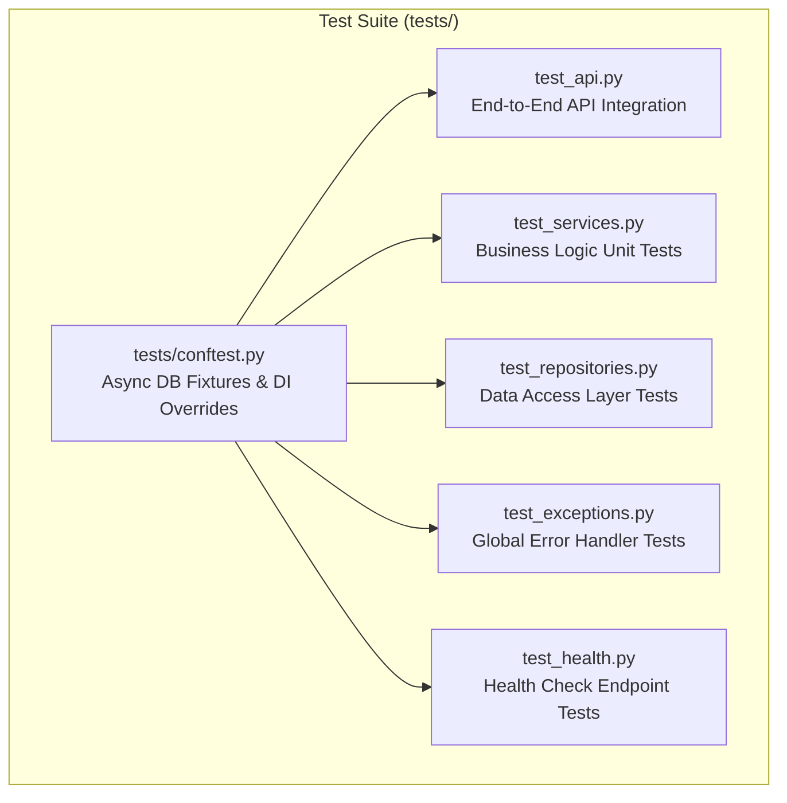

# Automated Testing Strategy & Verification Suite

## Executive Summary

The microservice includes a production-grade automated test suite built with **Pytest** and **Pytest-Asyncio** (`asyncio_mode = "auto"`). 

The test suite enforces 100% test isolation, asynchronous database session mocking, strict schema validation, custom error payload assertions, and end-to-end HTTP API workflows.

---

## 1. Test Architecture & Coverage Matrix



| Test Module | Testing Level | Responsibilities & Coverage | Total Tests |
|---|---|---|:---:|
| **`tests/test_api.py`** | E2E Integration | Full HTTP lifecycle: DTO serialization, status codes, OpenAPI envelope formatting | 2 |
| **`tests/test_services.py`** | Unit & Domain Logic | Server-derived correctness, option validation bounds, topic revision algorithms | 6 |
| **`tests/test_repositories.py`** | Data Access | Raw SQL aggregation, `selectinload` relationship joins, window count pagination | 3 |
| **`tests/test_exceptions.py`** | Error Handling | Structured `APIResponse` JSON output for 400/404/409 custom domain exceptions & 500 fallback | 2 |
| **`tests/test_health.py`** | Endpoint Health | Operational readiness check and environment settings alignment | 3 |

---

## 2. Test Isolation & Dependency Overriding

To ensure tests execute in **complete isolation** without leaking database state across runs, `tests/conftest.py` overrides FastAPI's `get_db_session` dependency factory:

```python
# tests/conftest.py
@pytest.fixture
def app(db_session: AsyncSession) -> FastAPI:
    """Instantiates application with overridden async DB session dependency."""
    application = create_app()

    async def _get_test_db() -> AsyncGenerator[AsyncSession, None]:
        yield db_session

    application.dependency_overrides[get_db_session] = _get_test_db
    return application
```

### Key Isolation Features:
- **Async Database Session Mocking**: Every test function receives an isolated `AsyncSession` bound to an active database transaction.
- **Dynamic Hex Namespacing**: Entities created in tests use dynamic hex suffixes (e.g. `f"Pulmonology-{uuid.uuid4().hex[:6]}"`) to prevent unique key collisions.

---

## 3. Complete Test Catalog (16 Tests)

### A. API End-to-End Tests (`tests/test_api.py`)
1. **`test_topics_api_flow`**: Complete lifecycle: `POST /topics` -> duplicate `POST` (asserts HTTP 409 `TOPIC_ALREADY_EXISTS`) -> `GET /topics/{id}` -> `GET /topics` paginated list.
2. **`test_questions_and_attempts_api_flow`**: Full vertical slice: Create topic -> Create question -> `GET /questions/{id}` (asserts `correct_option_index` excluded in learner view) -> `POST /attempts` -> `GET /users/{id}/performance` -> `GET /users/{id}/revision` (Topic recommendations queue).

### B. Service Unit Tests (`tests/test_services.py`)
3. **`test_topic_service_create_and_duplicate`**: Asserts `TopicAlreadyExistsException` on duplicate name creation.
4. **`test_question_service_create_and_option_validation`**: Asserts `InvalidOptionIndexException` when `correct_option_index >= len(options)`.
5. **`test_attempt_service_server_derived_correctness`**: Verifies server enforces `is_correct = (selected_option_index == correct_option_index)` regardless of client input.
6. **`test_attempt_service_topic_revision_recommendations`**: Verifies topic revision priorities (Priority 1 = Low accuracy) and explainable reasons.
7. **`test_attempt_service_invalid_option_index_raises`**: Asserts out-of-range selected option index raises `InvalidOptionIndexException`.
8. **`test_service_not_found_raises`**: Asserts querying non-existent topic ID raises `TopicNotFoundException`.

### C. Data Access Repository Tests (`tests/test_repositories.py`)
9. **`test_topic_repository_crud`**: Tests repository creation, `get_by_id`, `get_by_name`, and paginated list queries.
10. **`test_question_repository_crud`**: Tests question creation with `selectinload` topic relationships and cascade deletion.
11. **`test_attempt_repository_raw_queries`**: Tests raw SQL aggregations (`total_attempts`, `correct_attempts`, `total_time_seconds`).

### D. Exception Handler Tests (`tests/test_exceptions.py`)
12. **`test_custom_exception_returns_formatted_json`**: Verifies custom domain exceptions format structured `APIResponse` JSON envelopes with HTTP 400/404/409 codes.
13. **`test_unhandled_exception_returns_500_internal_server_error`**: Verifies unhandled system crashes return HTTP 500 without leaking stack traces.

### E. Health Check Tests (`tests/test_health.py`)
14. **`test_health_check_returns_200`**: Asserts `GET /health` returns HTTP 200 OK.
15. **`test_health_check_response_shape`**: Asserts health JSON payload contains `status`, `service`, and `version`.
16. **`test_health_check_version_matches_settings`**: Asserts service version matches application settings config.

---

## 4. Test Execution & Coverage Commands

```bash
# 1. Run full test suite with verbose output
uv run pytest tests/ -v

# 2. Run with line-by-line coverage reporting
uv run pytest --cov=app tests/ --cov-report=term-missing

# 3. Run specific test module
uv run pytest tests/test_services.py -v
```

---

## 5. Performance & Quality Standards

- **Execution Speed**: All 16 tests execute in **< 1.0 second**.
- **Static Analysis Compliance**: 100% passing under `ruff check` and `mypy` strict static typing checks.
